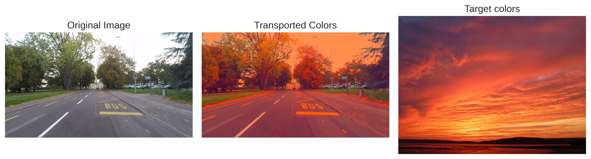
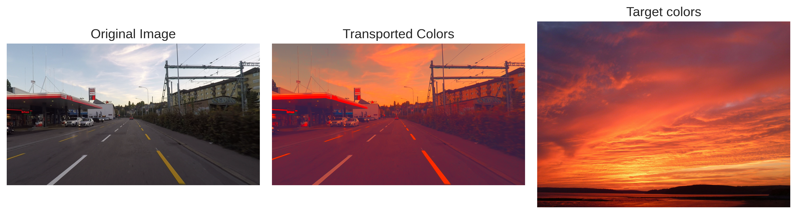

# 📈 Monotone Gradient Networks (MGN)

[](https://www.python.org/)
[](https://pytorch.org/)
[](LICENSE)

<div align="center">
  
  <p><em>Color Adaptation using Monotone Gradient Networks: Transporting color palette from Source to Target.</em></p>
</div>

This repository implements **Monotone Gradient Networks (MGN)** for solving optimal transport and generative modeling problems, based on the paper:

> **Chaudhari, S., Pranav, S., & Moura, J. M. (2023). Learning Gradients of Convex Functions with Monotone Gradient Networks. arXiv preprint arXiv:2301.10862.**

## 🧮 Problem Description & Math

The core problem addressed is **learning the gradient of a convex function** $\psi: \mathbb{R}^d \to \mathbb{R}$, denoted as $g(x) = \nabla \psi(x)$. Since $\psi$ is convex, its gradient $g(x)$ is a **monotone map**, meaning:
$$\langle g(x) - g(y), x - y \rangle \ge 0, \quad \forall x, y \in \mathbb{R}^d$$

This mathematical property is fundamental in:
1.  **Optimal Transport (OT)**: By Brenier's Theorem, the optimal transport map between two continuous probability measures (with quadratic cost) is the gradient of a strictly convex function.
2.  **Generative Modeling**: We can model a generative mapping pushing a latent distribution $\mu$ (e.g., Gaussian) to a target data distribution $\nu$ as $g_\* \mu = \nu$.

### 🧠 Leveraging MGN
Standard neural networks do not guarantee that the learned map is the gradient of a convex function. **MGN** architectures are specifically designed to parameterize such maps $g(x) = \nabla \psi(x)$ by construction.

We implement two variants of MGN in `src/monotone_grad_nets/models/`:
-   **M_MGN (Modular MGN)**: Uses a modular sum-structure with `log-cosh` smoothing and a PSD term ($V^T V$) to ensure monotonicity.
-   **C_MGN (Cascade MGN)**: Uses a cascading layer structure with shared weights to efficiently parameterize the map.

We also include Input Convex Neural Networks (ICNN) (`I_CNN` and `I_CGN`) for comparison.

## 📉 Losses

We train these networks using various loss functions depending on the task (Gradient Fitting vs. Optimal Transport). These are implemented in `src/monotone_grad_nets/trainers/trainer.py`.

### 1. 🎯 Gradient Fitting
When the true gradient $\nabla f(x)$ is known, we use regression:
-   **L1 Loss**: $\mathbb{E} [| g(x) - \nabla f(x) |]$
-   **MSE Loss**: $\mathbb{E} [\| g(x) - \nabla f(x) \|^2]$


### 2. 🚚 Optimal Transport & Generative Modeling
When we only have samples from the source $\mu$ and target $\nu$ distributions, we minimize:

- **Sinkhorn Divergence**: A regularized approximation of the Wasserstein distance, computed using the `geomloss` library.
  
     <div align="center"> $$\mathcal{L} = S_\epsilon(g_\* \mu, \nu) + \lambda\, \mathcal{C}_{\text{transport}}(g)$$
         
  </div> where $$\mathcal{C}_{\text{transport}}(g) = \mathbb{E}[\|x - g(x)\|^2]$$ penalizes the displacement.


-   **Negative Log Likelihood (NLL) / KL Divergence**:
    If fitting a map to a known target density (e.g., Gaussian), we maximize the likelihood of the mapped samples.
    $$\mathcal{L} = - \mathbb{E}_{x \sim \mu} \left[\log \nu(g(x)) + \log \det (\nabla g(x)) \right]$$.
    Here, $\nabla g(x) = \nabla^2 \psi(x)$ is the Hessian of the potential. We compute $\log \det(\nabla g(x))$ efficiently using `torch.linalg.slogdet`.

## 📓 Notebooks & Results

The `notebooks/` directory contains experiments demonstrating the capabilities of MGN:

-   **`01_sanity_check_trivial.ipynb`**: Basic validation of the models and training loop.
-   **`02_toy_2d_mapping.ipynb`**: Visualization of 2D Optimal Transport maps (e.g., mapping a Gaussian to a Mixture of Gaussians). Displays the warped grid and particle transport.
-   **`03_color_adaptation_cmgn.ipynb` & `03_color_adaptation_mmgn.ipynb`**: **Color Transfer** application. MGN learns to map the color palette of a source image to match a target image while preserving content structure.
-   **`04_mnist_generation.ipynb`**: **Generative Modeling**. Training an MGN to map Gaussian noise to the MNIST digits manifold.

## 🖼️ Visual Results

Here are some examples of **Color Adaptation** using Monotone Gradient Networks. The model learns to transport the color palette of a source image to a target image.

### M_MGN Results

*Figure 2: Color Transfer results using Modular MGN (M_MGN).*

## 📚 Citation

```bibtex
@article{chaudhari2023learning,
  title={Learning Gradients of Convex Functions with Monotone Gradient Networks},
  author={Chaudhari, Shreyas and Pranav, Srinivasa and Moura, José MF},
  journal={arXiv preprint arXiv:2301.10862},
  year={2023}
}
```